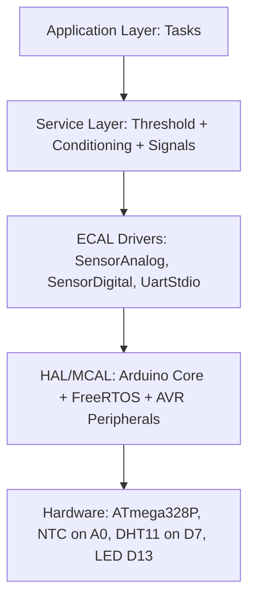
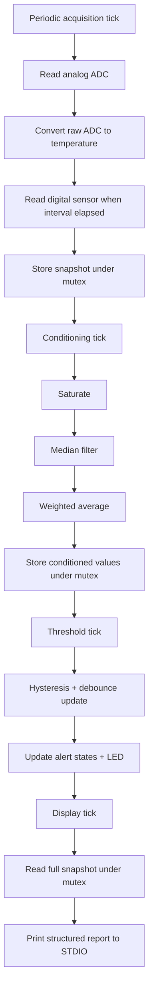
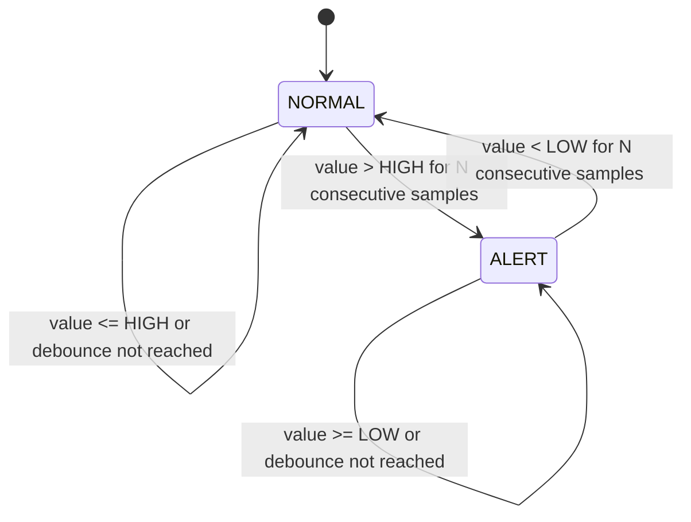

# Lab 6 Architecture

## 1. Component List and Roles

- MCU + FreeRTOS scheduler: runs periodic tasks and enforces timing.
- `SensorAnalog`: acquires ADC value and converts NTC raw signal to Celsius.
- `SensorDigital`: acquires DHT11 temperature/humidity.
- `Conditioning`: analog preprocessing pipeline (saturation, median filter, weighted average).
- `Threshold`: hysteresis + debounce finite-state logic for alerting.
- `Signals`: shared inter-task data and mutex protection.
- `Tasks`: application behavior (Acquisition, Conditioning, Threshold, Display).
- `UartStdio`: `printf` over serial.

## 2. Structural Diagram

```mermaid
graph LR
  A[Acquisition Task] -->|raw analog + digital| B[Shared Data (Signals)]
  C[Conditioning Task] -->|sat/median/wma| B
  D[Threshold Task] -->|alert states| B
  E[Display Task] -->|reads snapshot| B

  A --> F[SensorAnalog]
  A --> G[SensorDigital]
  C --> H[Conditioning Module]
  D --> I[Threshold Module]
  E --> J[UART STDIO]
```

## 3. Layered HW/SW View



## 4. Behavior Flow (Main Data Path)



## 5. Alert State Machine


